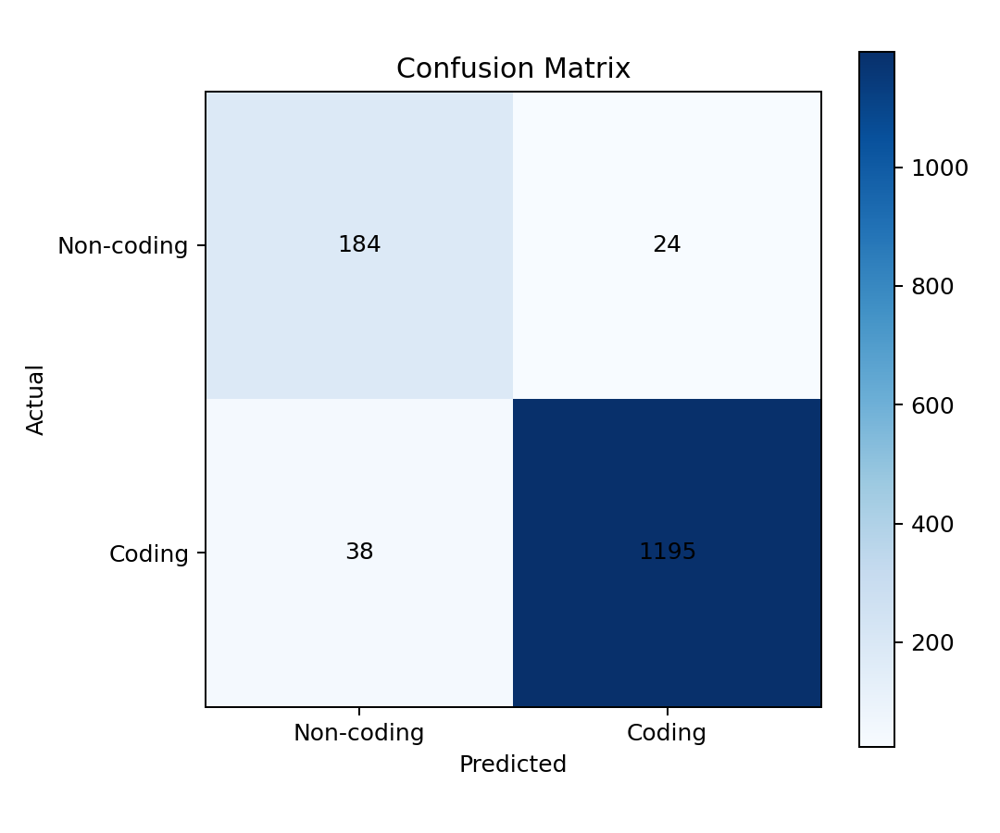
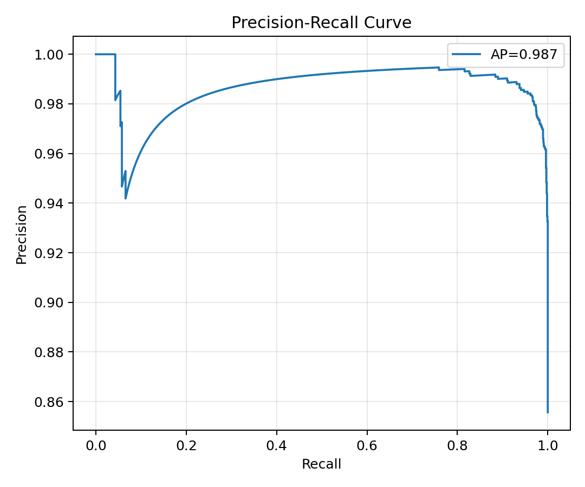

# Gene Prediction with Transformer (Coding vs Non-coding)

This repository contains a reproducible pipeline for **binary gene prediction** from genomic sequence:

- **Input**: `FASTA` + `GFF3`
- **Task**: classify sequence windows as:
  - `1` = coding
  - `0` = non-coding
- **Model**: custom **Transformer Encoder** in PyTorch

This implementation is based on the project report comparing deep learning approaches for gene prediction, where the custom transformer is evaluated against LSTM-based baselines.

## Project Goal

Traditional gene prediction pipelines often struggle on evolutionarily distant genomes.  
This project focuses on:

1. Building a deep learning workflow for coding/non-coding prediction.
2. Using sliding windows over genomic sequences.
3. Training a transformer model that captures long-range dependencies.
4. Reporting precision/recall/F1 and confusion matrix for evaluation.

## Repository Structure

```text
ML/
├── src/
│   ├── data_utils.py     # Parsing, extraction, merging, window generation, encoding
│   ├── model.py          # Transformer model
│   ├── train.py          # Training pipeline + checkpoint + metrics
│   ├── evaluate.py       # Evaluation from saved model/test split
│   └── __init__.py
├── requirements.txt
├── .gitignore
├── main.ipynb            # Original notebook workflow
├── main1.ipynb           # Cleaned walkthrough notebook with in-notebook plots (Sections 6.1/6.2)
└── README.md
```

## Setup

From project root:

```bash
python3 -m venv .venv
source .venv/bin/activate
pip install -r requirements.txt
```

## Data Layout

Place your input files in `data/` (recommended):

```text
data/
├── ergobibamus_cyprinoides_genome.fasta
└── ergobibamus_cyprinoides_labels.gff3
```

You can use any FASTA/GFF3 pair with matching sequence IDs.

## Train

Quick start (uses default files in `data/`):

```bash
python3 src/train.py
```

Explicit paths:

```bash
python3 src/train.py \
  --fasta data/ergobibamus_cyprinoides_genome.fasta \
  --gff3 data/ergobibamus_cyprinoides_labels.gff3 \
  --output-dir outputs \
  --window-size 1000 \
  --stride 1000 \
  --epochs 10 \
  --batch-size 32
```

### Main training arguments

- `--window-size`: sequence window length (default `1000`)
- `--stride`: sliding step (default `1000`)
- `--epochs`: training epochs
- `--batch-size`: batch size
- `--max-samples`: optional cap for faster experiments (`0` = all)
- `--embed-dim`, `--num-heads`, `--num-layers`, `--dropout`: model hyperparameters

## Evaluate

```bash
python3 src/evaluate.py \
  --model-path outputs/best_model.pth \
  --test-split outputs/test_split.npz \
  --output-json outputs/eval_metrics.json
```

## Output Artifacts

After training, `outputs/` contains:

- `best_model.pth` – best checkpoint by validation accuracy
- `metrics.json` – test accuracy, report, confusion matrix, config
- `test_split.npz` – saved test split for reproducible evaluation
- `label_mapping.json` – class mapping

## 6. Results

### 6.1 Confusion Matrix



### 6.2 Precision-Recall Curve



## Notes

- The training script currently performs random train/val/test split over generated windows from the provided FASTA/GFF3 pair.
- For species-level benchmarking (train on one species, test on another), run training and evaluation with separate curated input sets.
- Large raw genomic files (`.zip`, `.fasta`, `.gff3`) are ignored by default in `.gitignore`.

## Related Report

Project report files (provided in this repository):

- `6-Pages-Z.Tavakolirad, J.Shao.pdf`
- `6-Pages-Z.Tavakolirad,J.Shao.docx`

They describe the research context, dataset motivation, and comparison framing for transformer-based gene prediction.
